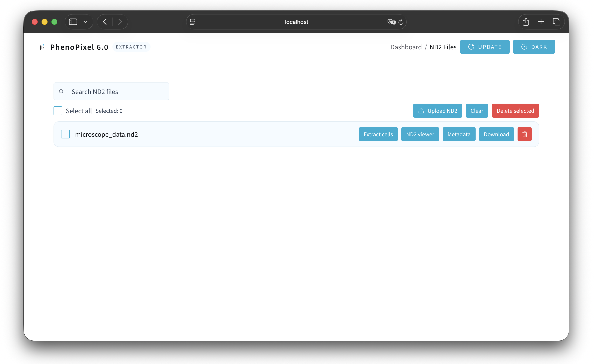
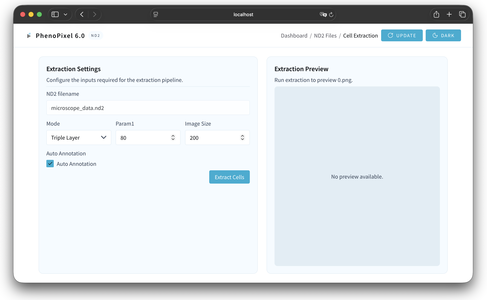
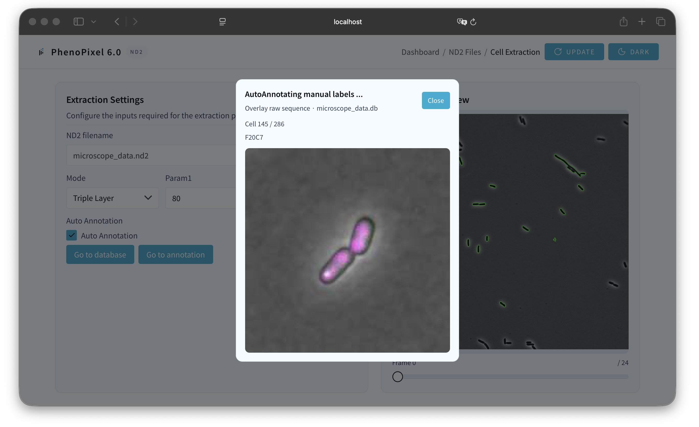
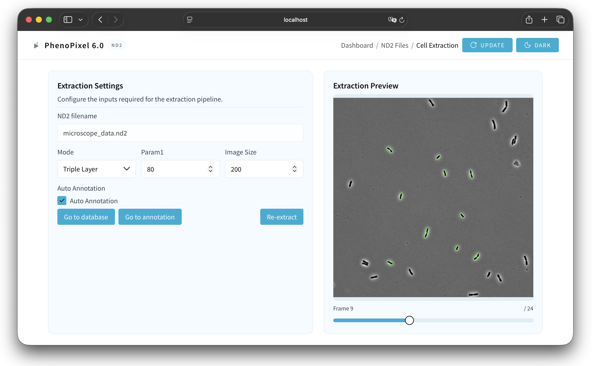
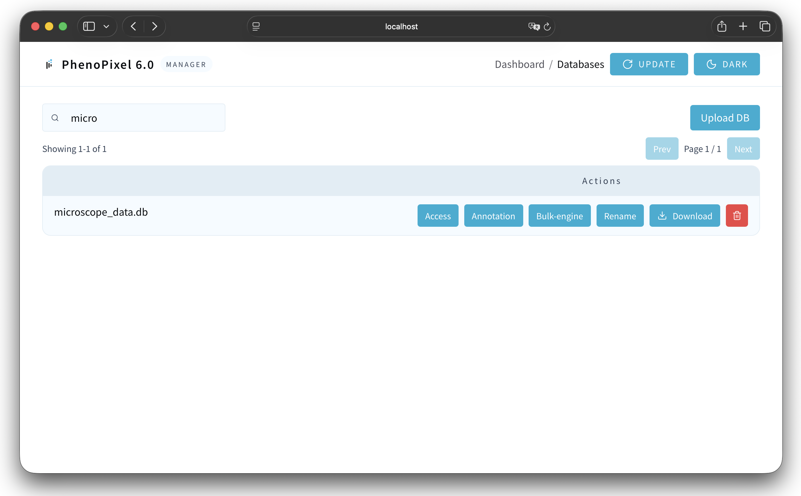
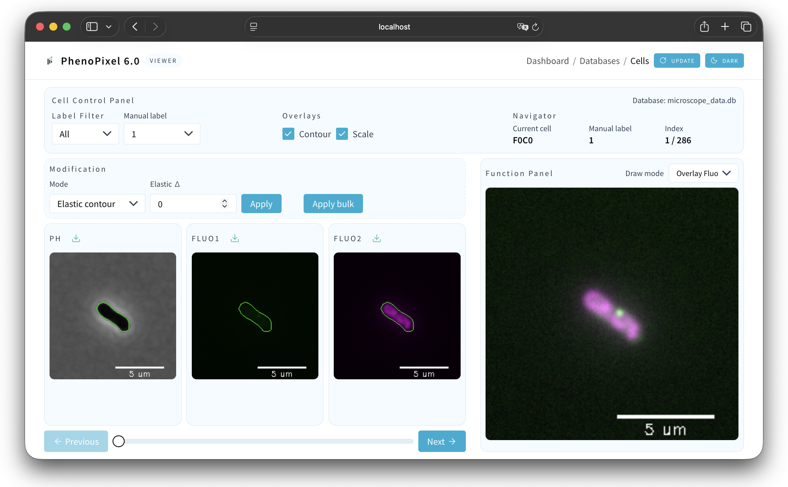
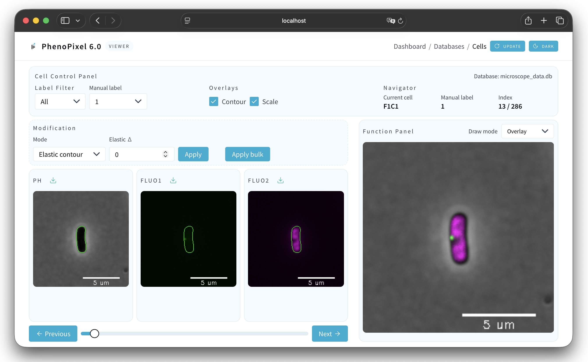
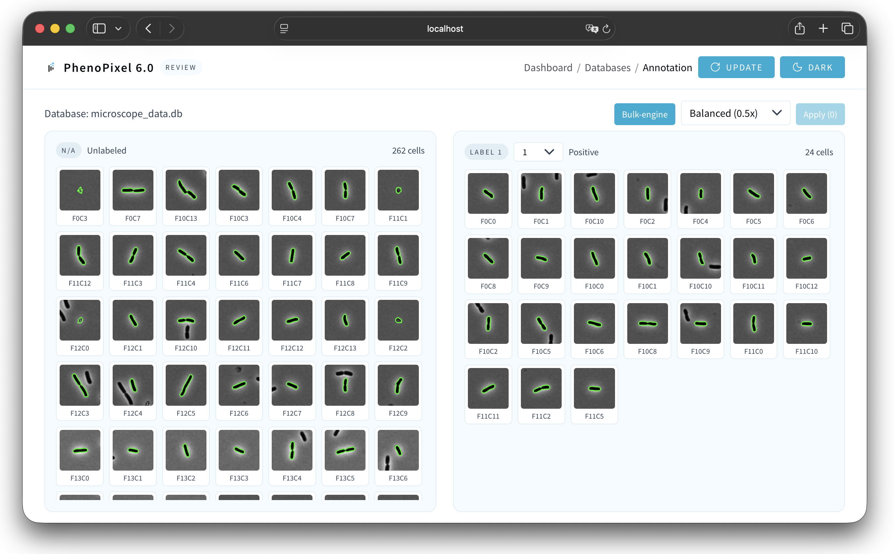

# PhenoPixel6.0

PhenoPixel6.0 is a backend + frontend app for microscopy cell extraction and
batch analytics. The backend exposes APIs under `/api/v1`, and the frontend
provides a UI for running workflows.


## ND2 Manager

Manage ND2 files in this page: upload new datasets, delete existing ones, and select a specific ND2 file to proceed to Cell Extraction.



## Cell Extraction

1. Configure extraction. For the selected ND2 file, choose the Canny algorithm parameters, ROI crop size, number of fluorescence layers, and whether Auto Annotation is on or off. Press `Extract cells` to start the extraction run.



2. Auto annotation behavior. When Auto Annotation is `On`, an additional post-processing step runs after extraction to automatically separate cells from debris.



3. Review results and proceed. When extraction finishes, the right panel shows all extracted cell contours across every frame. From here you can open the generated cell database or go to the cell labeling (annotation) page. If contours are not extracted well (for example, due to mismatched Canny parameters), adjust settings in the parameter tuning section and click `Re-extract` to run extraction again.



## Database Manager

This screen lists the cell databases generated by Cell Extraction. You can upload or download databases here, making it possible to separate an experiment’s database from the system as a single file.



When you click `Access` on a specific cell database row, you are taken to a page where you can review information for each individual cell.



The function panel offers the following view modes:
- `Contour`: view extracted contours only.
- `Replot`: refresh the current plot from stored data.
- `Overlay`: overlay contours on the default image.
- `Overlay Raw`: overlay contours on the raw image.
- `Overlay Fluo`: overlay contours on the fluorescence image.
- `Heatmap`: visualize signal intensity as a heatmap.
- `Map 256`: render a 256-level mapped view.
- `Distribution`: show the value distribution for the selected cell or region.



## Annotation

Auto-detected contours can include debris or merged cells (not single cells), so you need to remove these manually.


To label `Label 1` (right panel), click a target cell (single cell) or use Shift + drag to select multiple cells, then press `Apply`. The right panel updates the labels in real time. You can also revert `Label 1` back to `N/A` (backwards labeling is supported).




## Bulk engine

## Requirements

- Python 3.x (Launch uses `python3.14`)
- Node.js with npm (frontend dev/build)
- SQLite (used by the backend; databases generated by Cell Extraction)

## Quick Start

Backend:

```sh
python3.14 -m venv venv
source ./venv/bin/activate
cd backend
pip install -r requirements.txt
python main.py
```

Frontend:

```sh
cd frontend
npm install
npm run dev
```

- Backend: http://localhost:3000
- Frontend dev server: http://localhost:3001

## Local URLs

- API base: http://localhost:3000/api/v1
- Swagger UI (OpenAPI): http://localhost:3000/api/v1/docs
- OpenAPI JSON: http://localhost:3000/api/v1/openapi.json
- Health check: http://localhost:3000/api/v1/health

## Docker Deploy (Traefik)

Use `docker/compose.yaml` to start Traefik + backend.

1) Create `backend/.env` (use `backend/.env.template` as a reference)
2) Set `SERVER_HOST` and `TRAEFIK_ACME_EMAIL`
3) Start:

```sh
cd docker
docker compose -f compose.yaml up -d --build
```

Traefik uses `80/443`. Access the hostname set in `SERVER_HOST`, and the API
is exposed under `/api/v1`.

## Tech Stack

Backend:

<p align="left">
  <a href="https://fastapi.tiangolo.com/" title="FastAPI">
    
  </a>
  <a href="https://www.sqlalchemy.org/" title="SQLAlchemy">
    
  </a>
  <a href="https://numpy.org/" title="NumPy">
    
  </a>
  <a href="https://opencv.org/" title="OpenCV">
    
  </a>
  <a href="https://matplotlib.org/" title="Matplotlib">
    
  </a>
</p>

- FastAPI, Uvicorn, Pydantic for the API layer
- SQLAlchemy for SQLite access
- NumPy, OpenCV, Matplotlib for image processing and plotting

Frontend:

<p align="left">
  <a href="https://react.dev/" title="React">
    
  </a>
  <a href="https://vitejs.dev/" title="Vite">
    
  </a>
  <a href="https://www.typescriptlang.org/" title="TypeScript">
    
  </a>
  <a href="https://chakra-ui.com/" title="Chakra UI">
    
  </a>
</p>

- React + React Router for the UI
- Vite for dev/build tooling
- Chakra UI and Framer Motion for styling and motion

## Docs

- Bulk Engine API: [backend/app/bulk_engine/README.md](backend/app/bulk_engine/README.md)
- Cell Extraction API: [backend/app/cellextraction/README.md](backend/app/cellextraction/README.md)
- Frontend: [frontend/README.md](frontend/README.md)
