# PhenoPixel6.0

PhenoPixel6.0 is a backend + frontend app for microscopy cell extraction and
batch analytics. The backend exposes APIs under `/api/v1`, and the frontend
provides a UI for running workflows.


## ND2 Manager

Manage ND2 files in this page: upload new datasets, delete existing ones, and select a specific ND2 file to proceed to Cell Extraction.

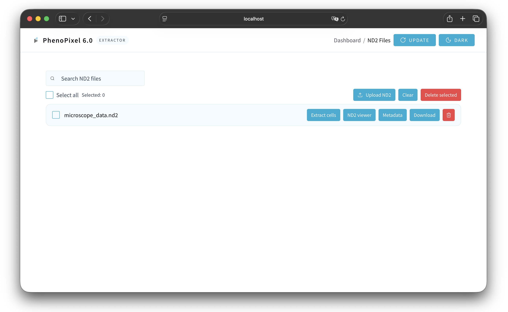

## Cell Extraction

1. Configure extraction. For the selected ND2 file, choose the Canny algorithm parameters, ROI crop size, number of fluorescence layers, and whether Auto Annotation is on or off. Press `Extract cells` to start the extraction run.

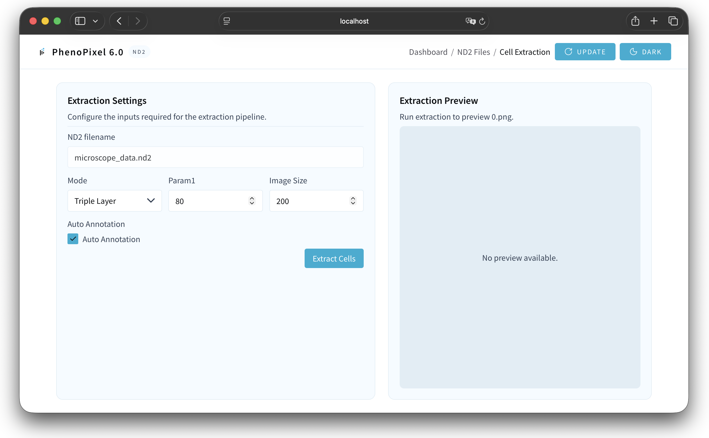

2. Auto annotation behavior. When Auto Annotation is `On`, an additional post-processing step runs after extraction to automatically separate cells from debris.

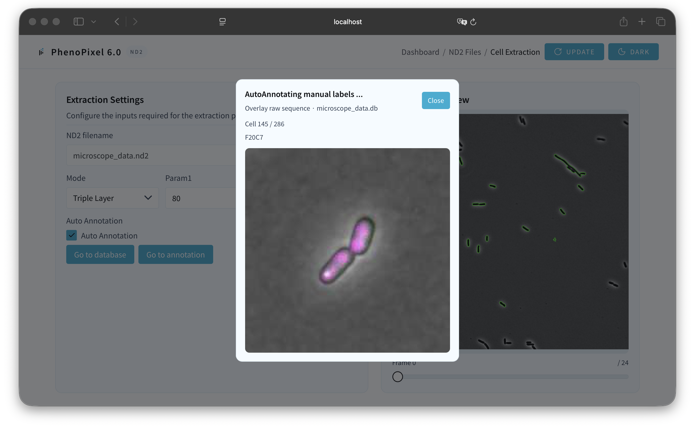

3. Review results and proceed. When extraction finishes, the right panel shows all extracted cell contours across every frame. From here you can open the generated cell database or go to the cell labeling (annotation) page. If contours are not extracted well (for example, due to mismatched Canny parameters), adjust settings in the parameter tuning section and click `Re-extract` to run extraction again.

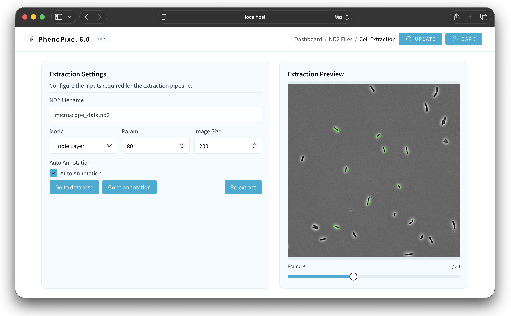

## Database Manager

This screen lists the cell databases generated by Cell Extraction. You can upload or download databases here, making it possible to separate an experiment’s database from the system as a single file.

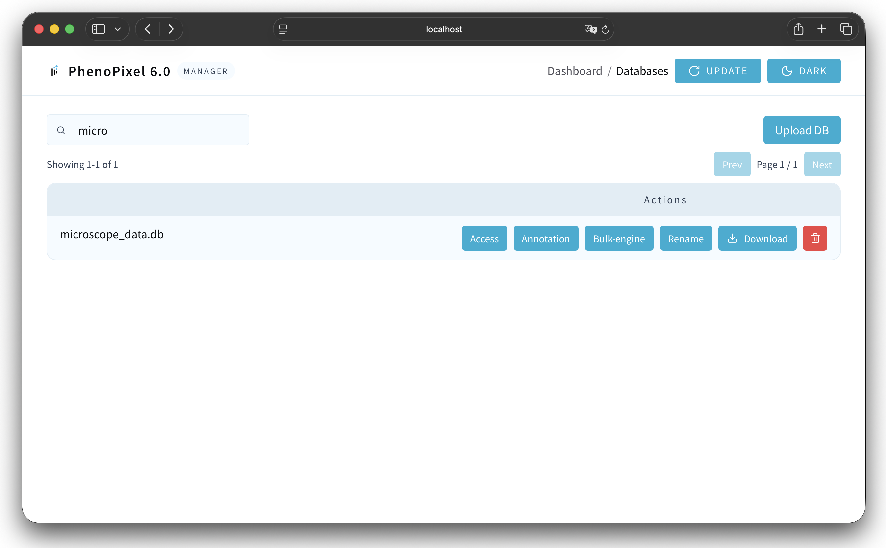

When you click `Access` on a specific cell database row, you are taken to a page where you can review information for each individual cell.

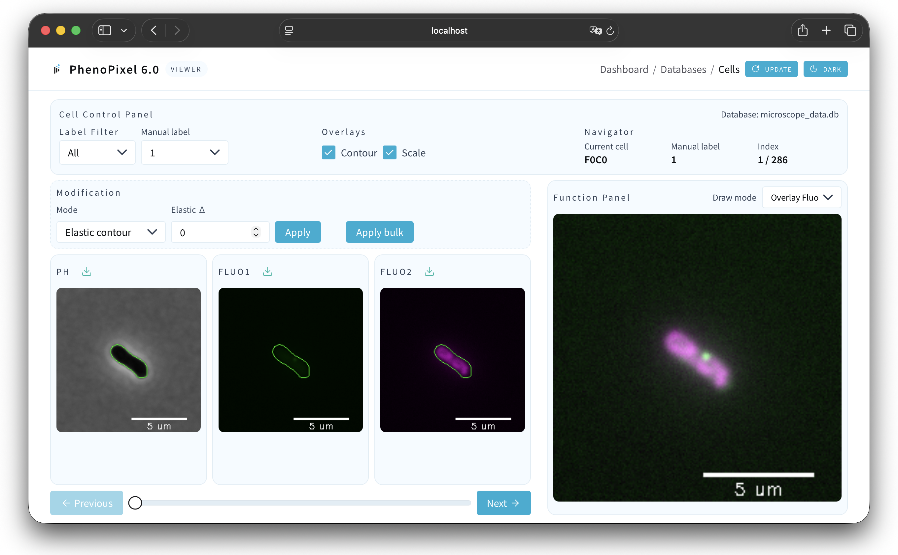

The function panel offers the following view modes:
- `Contour`: view extracted contours only.
- `Replot`: refresh the current plot from stored data.
- `Overlay`: overlay contours on the default image.
- `Overlay Raw`: overlay contours on the raw image.
- `Overlay Fluo`: overlay contours on the fluorescence image.
- `Heatmap`: visualize signal intensity as a heatmap.
- `Map 256`: render a 256-level mapped view.
- `Map Raw`: render the mapped view at native pixel resolution.
- `Distribution`: show the value distribution for the selected cell or region.

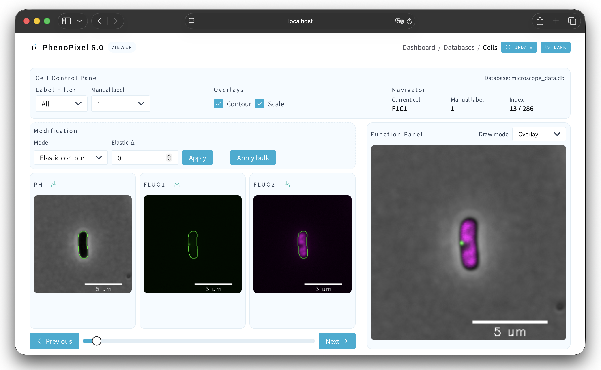

## Annotation

Auto-detected contours can include debris or merged cells (not single cells), so you need to remove these manually.

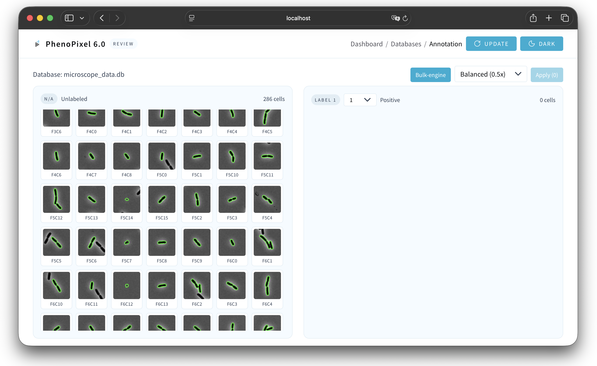

To label `Label 1` (right panel), click a target cell (single cell) or use Shift + drag to select multiple cells, then press `Apply`. The right panel updates the labels in real time. You can also revert `Label 1` back to `N/A` (backwards labeling is supported).

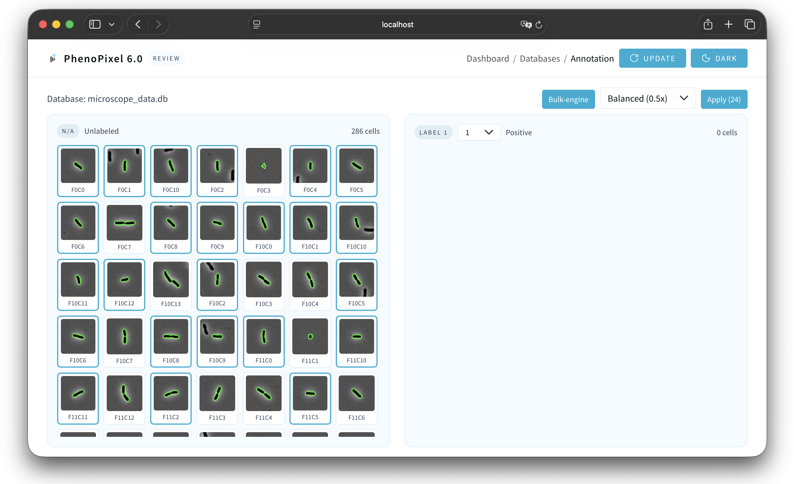

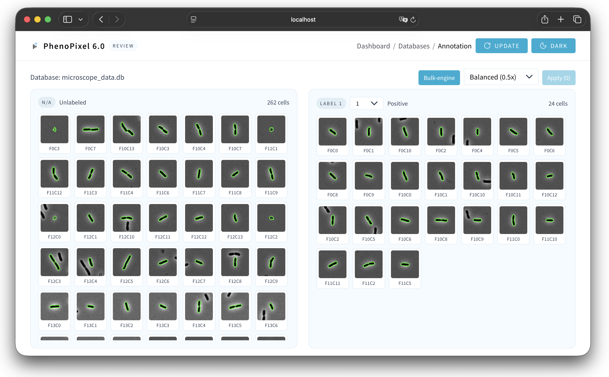

## Bulk Engine

For a database after annotation, the left panel shows the cells labeled with the default `Label 1`. If debris or non-single cells are mixed in, return to the Annotation page and relabel. Once only single cells are labeled, you can run batch analytics on this population.

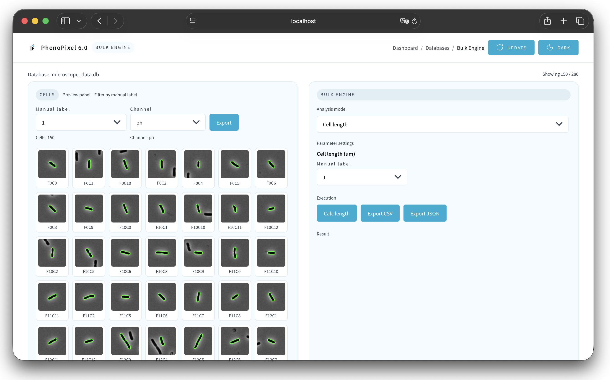

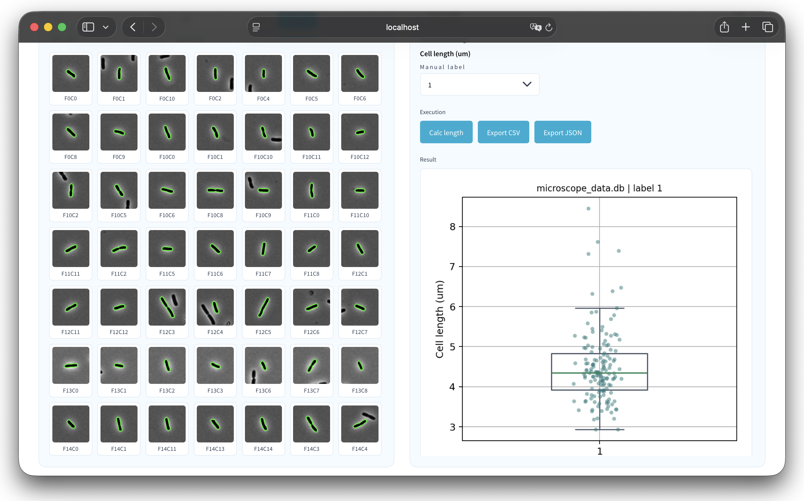

Batch analysis modes available in Bulk Engine include:
- `Cell length`: measure cell length (um) from contours.
- `Cell area`: compute cell area (px^2).
- `Normalized median`: calculate normalized median intensity per cell for a selected channel.
- `FITC aggregation ratio`: compute aggregation ratio for FITC signal.
- `Entropy`: quantify intensity distribution using entropy (1 - sparsity).
- `Heatmap`: generate heatmap vectors/plots for the selected channel.
- `Contours`: visualize aligned contours and export contour coordinates.
- `Map256`: render a Map256 strip across cells.
- `Raw data`: export raw intensity values inside each contour.

JSON export is also supported, including raw intensity data.

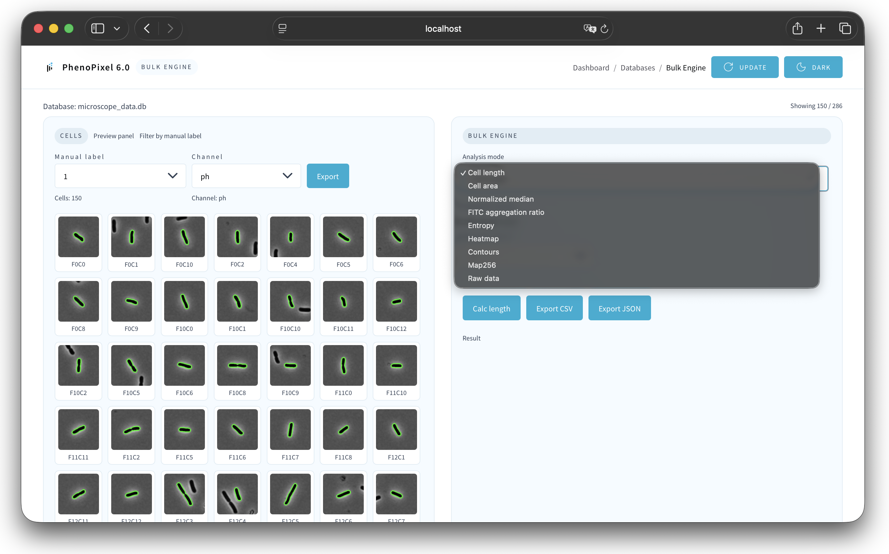

For example, in `Heatmap` mode you can aggregate and visualize GFP localization for all cells of the selected label in a single plot.

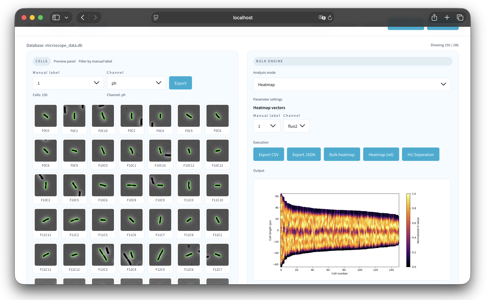

## Methods

The quantitative routines in PhenoPixel6.0 follow a common single-cell analysis pipeline: detect a contour from the phase-contrast image, re-parameterize the cell in its intrinsic coordinate system, and compute shape or fluorescence descriptors that are directly comparable across cells. Let \(C = \{(x_i, y_i)\}_{i=1}^n\) be the contour points of one cell and let \(\Omega_C\) be the set of pixels inside that contour.

### 1. Contour Extraction, Principal Axis, and Basis Transform

Contours are extracted from phase-contrast images with a Canny-based pipeline. The major elongation axis is estimated from the covariance of contour coordinates,

$$
\Sigma =
\begin{pmatrix}
\mathrm{Var}[X_1] & \mathrm{Cov}[X_1, X_2] \\
\mathrm{Cov}[X_1, X_2] & \mathrm{Var}[X_2]
\end{pmatrix},
$$

and the principal direction is the solution of

$$
\mathbf{w}^* = \underset{\|\mathbf{w}\| = 1}{\mathrm{arg\,max}} \mathbf{w}^{\mathsf{T}} \Sigma \mathbf{w},
\qquad
\Sigma \mathbf{w} = \lambda \mathbf{w}.
$$

If \(Q = (\mathbf{v}_1\ \mathbf{v}_2)\) is the orthonormal eigenvector basis, coordinates are transformed to the cell-aligned frame by

$$
\mathbf{u} = Q^{\mathsf{T}} \mathbf{x},
\qquad
\mathbf{x} = Q \mathbf{u}.
$$

This removes arbitrary image rotation and makes bent or filamentous cells easier to model analytically.

### 2. Centerline Fitting and Cell Length

In the aligned frame, the cell centerline is approximated by a \(k\)-th order polynomial

$$
\hat{f}(u_1) = \theta^{\mathsf{T}} \phi(u_1),
\qquad
\theta = (W^{\mathsf{T}} W)^{-1} W^{\mathsf{T}} f.
$$

For a curved cell, the thesis formulation defines cell length as the arc length between the two contour-centerline intersection points:

$$
L = \int_{u_{1,a}}^{u_{1,b}}
\sqrt{1 + \left(\frac{d\hat{f}}{du_1}\right)^2}\,du_1.
$$

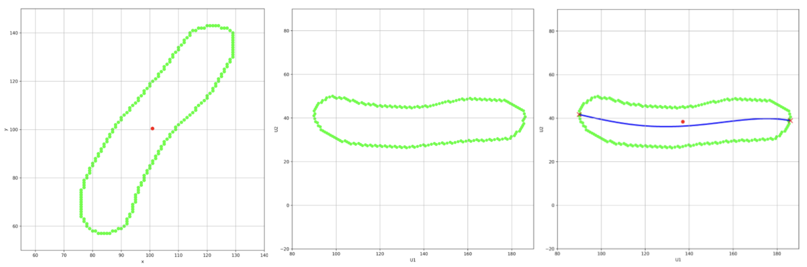

In the current backend implementation, `Cell length` is returned as a robust PCA major-axis extent of pixels inside the contour and converted with a fixed pixel size of \(0.065\,\mu\mathrm{m}/\mathrm{px}\):

$$
L_{\mathrm{API}} \approx \left(\max_i \pi_i - \min_i \pi_i\right) \times 0.065.
$$

### 3. Cell Area and Raw Pixel Export

Cell area is the area enclosed by the contour,

$$
A(C) = \iint_{\Omega_C} 1\,dA,
$$

which is stored during extraction and reported by `Cell area`. `Raw data` exports the unaggregated intensity set

$$
\{ I(p) \mid p \in \Omega_C \}
$$

for the selected channel.

### 4. Fluorescence Vectorization Along the Centerline

For each intracellular pixel \((p_i, q_i)\) with intensity \(G(p_i, q_i)\), the nearest point on the fitted centerline is found by

$$
u_{1,i}^* = \underset{u_1 \in [u_{1,a}, u_{1,b}]}{\mathrm{arg\,min}}
\left[(u_1 - p_i)^2 + (\hat{f}(u_1) - q_i)^2\right].
$$

This position is converted to arc length,

$$
\ell(u_1) = \int_{u_{1,a}}^{u_1} \sqrt{1 + \left(\hat{f}'(t)\right)^2}\,dt,
\qquad
\ell_i^* = \ell(u_{1,i}^*).
$$

To obtain a fixed-dimensional descriptor, the arc-length interval \([0, L]\) is divided into \(n\) bins and max-pooled:

$$
g_j =
\begin{cases}
\max_{i:\ell_i^* \in I_j} G(p_i, q_i), & \text{if the bin is non-empty}, \\
0, & \text{otherwise},
\end{cases}
\qquad
\mathbf{g} = (g_1, \dots, g_n)^{\mathsf{T}}.
$$

The current implementation uses \(n = 35\) and a default polynomial degree of \(k = 4\). `Heatmap` visualizes these peak vectors either in absolute-length coordinates or in relative-position coordinates.

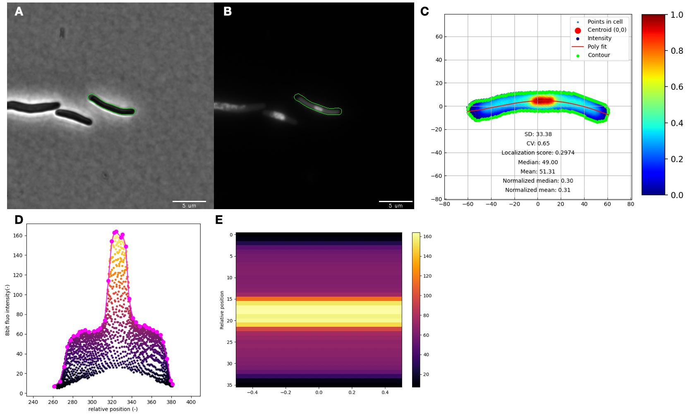

### 5. Normalized Median and Aggregation-Style Scores

For any selected channel, intensities inside a cell are normalized by the cellwise maximum,

$$
\tilde{I}_i = \frac{I_i}{\max_{p \in \Omega_C} I(p)},
\qquad
m(C) = \mathrm{median}(\tilde{I}_i).
$$

This scalar is reported by `Normalized median`. A population-level aggregation score can then be written as

$$
R(\tau) = \frac{1}{N} \sum_{c=1}^{N} \mathbf{1}[m(C_c) < \tau].
$$

The current `FITC aggregation ratio` plot uses this form with a default cutoff \(\tau = 0.7414\). In the thesis experiments, the same normalized-median idea was also used for IbpA-GFP and TorA-GFP abnormal-localization calls, with an example threshold of \(m \le 0.6\) for those datasets.

### 6. Thesis-Specific Phenotype Calls

For HU-GFP compaction, a 35-bin peak vector is first computed and summarized as

$$
s(C) = \sum_{j=1}^{35} g_j.
$$

Using the control population, the abnormality threshold is defined by the 5th percentile,

$$
\tau_{\mathrm{HU}} = Q_{0.05}\left(\{ s(C_c^{\mathrm{ctrl}}) \}\right),
$$

and the HU aggregation ratio is the fraction of cells with \(s(C) < \tau_{\mathrm{HU}}\).

For PI permeability, the mean intracellular PI intensity is

$$
\mu(C) = \frac{1}{|\Omega_C|} \sum_{p \in \Omega_C} I_{\mathrm{PI}}(p),
$$

with a control-derived positivity threshold

$$
\tau_{\mathrm{PI}} = Q_{0.95}\left(\{ \mu(C_c^{\mathrm{ctrl}}) \}\right).
$$

The PI-positive fraction is then the proportion of cells satisfying \(\mu(C) > \tau_{\mathrm{PI}}\).

## Requirements

- Python 3.x (Launch uses `python3.14`)
- Node.js with npm (frontend dev/build)
- SQLite (used by the backend; databases generated by Cell Extraction)

## Quick Start

Backend:

```sh
python3.14 -m venv venv
source ./venv/bin/activate
cd backend
pip install -r requirements.txt
python main.py
```

Frontend:

```sh
cd frontend
npm install
npm run dev
```

- Backend: http://localhost:3000
- Frontend dev server: http://localhost:3001

## Local URLs

- API base: http://localhost:3000/api/v1
- Swagger UI (OpenAPI): http://localhost:3000/api/v1/docs
- OpenAPI JSON: http://localhost:3000/api/v1/openapi.json
- Health check: http://localhost:3000/api/v1/health

## Docker Deploy (Traefik)

Use `docker/compose.yaml` to start Traefik + backend.

1) Create `backend/.env` (use `backend/.env.template` as a reference)
2) Set `SERVER_HOST` and `TRAEFIK_ACME_EMAIL`
3) Start:

```sh
cd docker
docker compose -f compose.yaml up -d --build
```

Traefik uses `80/443`. Access the hostname set in `SERVER_HOST`, and the API
is exposed under `/api/v1`.

## Tech Stack

Backend:

<p align="left">
  <a href="https://fastapi.tiangolo.com/" title="FastAPI">
    
  </a>
  <a href="https://www.sqlalchemy.org/" title="SQLAlchemy">
    
  </a>
  <a href="https://numpy.org/" title="NumPy">
    
  </a>
  <a href="https://opencv.org/" title="OpenCV">
    
  </a>
  <a href="https://matplotlib.org/" title="Matplotlib">
    
  </a>
</p>

- FastAPI, Uvicorn, Pydantic for the API layer
- SQLAlchemy for SQLite access
- NumPy, OpenCV, Matplotlib for image processing and plotting

Frontend:

<p align="left">
  <a href="https://react.dev/" title="React">
    
  </a>
  <a href="https://vitejs.dev/" title="Vite">
    
  </a>
  <a href="https://www.typescriptlang.org/" title="TypeScript">
    
  </a>
  <a href="https://chakra-ui.com/" title="Chakra UI">
    
  </a>
</p>

- React + React Router for the UI
- Vite for dev/build tooling
- Chakra UI and Framer Motion for styling and motion

## Docs

- Bulk Engine API: [backend/app/bulk_engine/README.md](backend/app/bulk_engine/README.md)
- Cell Extraction API: [backend/app/cellextraction/README.md](backend/app/cellextraction/README.md)
- Frontend: [frontend/README.md](frontend/README.md)
